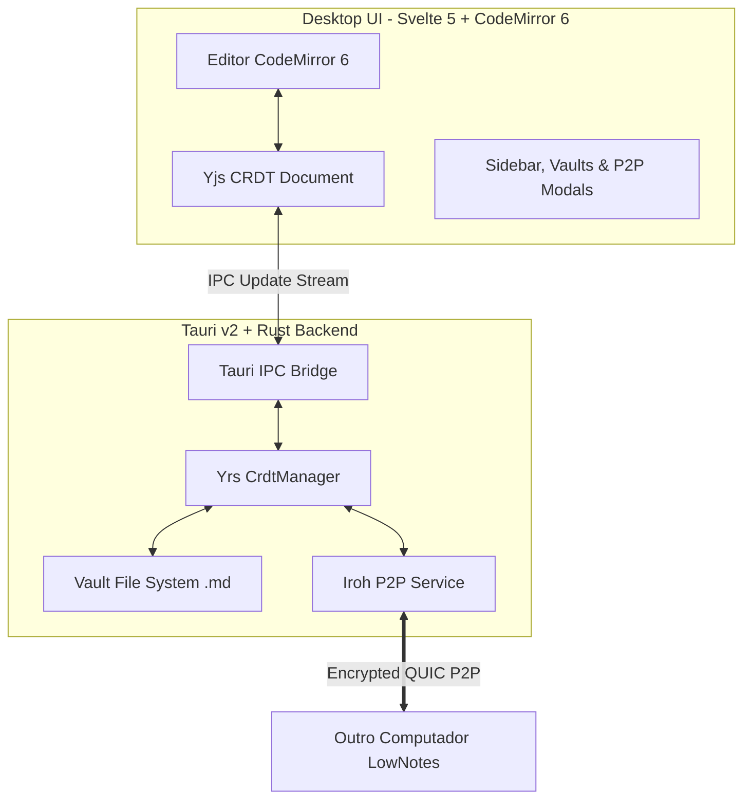

# LowNotes

Editor de notas Markdown desktop **local-first**, ultra-rápido, com **sincronização P2P criptografada** e **edição colaborativa em tempo real** sem necessidade de servidor central.

---

## ⚡ Filosofia LowBloat

- **Zero Bloat:** Binário leve nativo compilado com **Tauri v2** e **Rust**.
- **100% Compatível com Markdown:** Suas notas permanecem como arquivos `.md` limpos no seu disco rígido, acessíveis por qualquer editor (VS Code, Obsidian, Notepad).
- **Sem Servidor Central:** Sincronização direta de máquina para máquina via **Iroh** (QUIC ponta a ponta com criptografia ed25519 e transposição NAT/DERP).
- **Colaboração em Tempo Real (CRDT):** Mais de um usuário pode editar a mesma nota simultaneamente sem conflitos, unindo **CodeMirror 6 + Yjs** no frontend e **Yrs** no backend em Rust.
- **RAG Local & Assistente de IA:** Chat integrado na barra lateral direita compatível com qualquer provedor OpenAI (Ollama, OpenAI, OpenRouter, Groq, LM Studio ou Custom), com busca semântica local e citações clicáveis que abrem a nota na linha exata.
- **Visualização de Diagramas Mermaid:** Renderização vetorial SVG interativa em tempo real de fluxogramas, gráficos de pizza e sequências no Markdown.
---

## 🏗️ Arquitetura



### Tecnologias

- **Desktop Shell & Backend:** Tauri v2 (Rust 2021)
- **Rede P2P:** [Iroh 1.2](https://iroh.computer/) (QUIC autenticado com chaves ed25519)
- **CRDT / Colaboração:** [Yrs](https://github.com/y-crdt/y-crdt) (Rust) & [Yjs](https://yjs.dev/) (TypeScript)
- **Frontend:** Svelte 5 (Runes), TypeScript, Tailwind CSS v4
- **Editor de Texto:** CodeMirror 6 (`@codemirror/lang-markdown`, `y-codemirror.next`)
- **Renderizador de Markdown & Diagramas:** markdown-it com extensões para listas de definição, notas de rodapé, abreviações, contêineres, emoji e listas de tarefas + [Mermaid 12](https://mermaid.js.org/)
- **Assistente IA & RAG:** RAG local no Rust compatível com APIs OpenAI (Ollama local, OpenAI, OpenRouter, Groq, LM Studio, etc.)

---

## 🚀 Como Executar

### Pré-requisitos

- [Rust](https://rustup.rs/) (1.77+)
- [Bun](https://bun.sh/) (1.1+)

### Desenvolvimento

Instale as dependências:
```bash
bun install
```

Inicie o aplicativo em modo de desenvolvimento:
```bash
bun run tauri dev
```

### Build de Produção

Gera o executável nativo otimizado:
```bash
bun run tauri build
```

O modo **Dividido** é o padrão. O tema e o modo de visualização escolhidos são salvos em `settings.json` no diretório de configuração do LowNotes, junto das demais preferências.

---

## 🔗 Como Testar Pareamento P2P entre 2 Computadores

1. Abra o **LowNotes** nos dois computadores e selecione uma pasta para o seu Vault.
2. No **PC 1**:
   - Clique em **P2P Offline** ou **Gerenciar Conexões** no rodapé da barra lateral.
   - Na aba **Compartilhar Código**, clique em **Copiar Código**.
3. No **PC 2**:
   - Abra a janela de **Sincronização P2P**.
   - Na aba **Conectar Dispositivo**, cole o código `LOWNOTES1_...` e clique em **Solicitar Pareamento**.
4. No **PC 1**:
   - Um alerta de confirmação aparecerá: *"O dispositivo Notebook (ID: ...) deseja sincronizar este vault. Deseja aceitar?"*.
   - Clique em **Aceitar Conexão**.
5. **Pronto!**
   - Os dois computadores agora estão pareados de forma confiável.
   - Qualquer nota criada ou editada em um PC sincroniza instantaneamente no outro.
   - Ao abrir a mesma nota nos dois computadores, a digitação reflete em tempo real sem servidor!

---

## 🛡️ Licença

Distribuído sob a licença GPL-3.0. Consulte `LICENSE` para mais informações.
