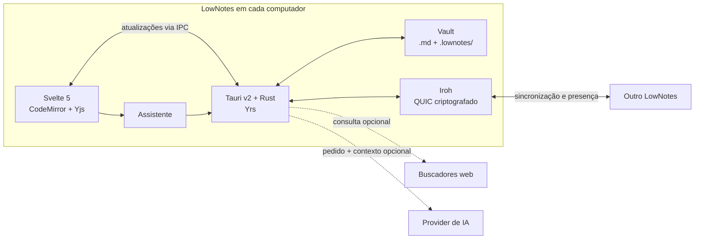

<p align="center">
  
</p>

<h1 align="center">LowNotes</h1>

<p align="center">
  Suas notas em Markdown, no seu computador.<br>
  Edição colaborativa P2P quando você quiser.
</p>

<p align="center">
  <a href="https://github.com/LowBloat/LowNotes/releases/latest">Baixar o aplicativo</a>
  · <a href="#comece-aqui">Comece aqui</a>
  · <a href="#como-funciona">Como funciona</a>
  · <a href="#desenvolvimento">Desenvolvimento</a>
</p>

---

O LowNotes é um editor desktop para quem quer **arquivos Markdown legíveis**, uma interface confortável e colaboração entre dispositivos sem hospedar um servidor de notas. Você pode trabalhar só com arquivos locais; pareamento P2P e assistente de IA são opcionais.

| No dia a dia | Quando você precisa de mais |
| --- | --- |
| Editor e prévia Markdown lado a lado, com diagramas Mermaid | Edição em tempo real com CodeMirror, Yjs e Yrs |
| Pastas, links entre notas e mapa de conexões | Sincronização P2P criptografada com Iroh |
| Temas Megumin e Rimuru Tempest, além de paletas personalizadas | Assistente com busca no vault, pesquisa web e exportação Word/PDF |
| Notas em `.md` que abrem em outros editores | Cópias de conflito para revisar edições offline divergentes |

## Comece aqui

1. Baixe a versão para Windows, Linux ou macOS em [Releases](https://github.com/LowBloat/LowNotes/releases/latest).
2. Abra o LowNotes e escolha uma pasta para o **vault**. Você pode usar uma pasta que já contém arquivos `.md`.
3. Crie uma nota ou abra uma existente. Alterne entre **Editor**, **Dividido** e **Visualizar**; o modo dividido é o padrão.
4. Se quiser sincronizar outro computador, abra **Gerenciar Conexões** na barra lateral e siga o [pareamento P2P](#pareamento-p2p).
5. Se quiser usar IA, escolha um modelo em **Configurações → Providers**. Ollama e LM Studio funcionam localmente quando o serviço e o modelo estão instalados; provedores remotos precisam das credenciais correspondentes.

Ao fechar a janela, o aplicativo permanece na bandeja do sistema por padrão. Esse comportamento pode ser alterado em **Configurações → Geral**; o menu da bandeja também permite sair completamente.

## O que o aplicativo oferece

### Notas e organização

- Markdown editável com prévia, tarefas, tabelas, notas de rodapé, extensões de sintaxe e diagramas Mermaid.
- Pastas, busca de notas, links `[[entre notas]]` e links Markdown locais. O mapa de links combina relações escritas nas notas com relações adicionadas manualmente ou pelo assistente.
- Exportação de notas e rascunhos para Word (`.docx`) e PDF. Títulos, listas, tarefas, tabelas, código e links externos são preservados; diagramas Mermaid saem como código e imagens como texto alternativo e endereço.
- Configurações reunidas em uma tela: preferências gerais, temas, IA, providers, fontes de busca web e informações do aplicativo.

### Assistente opcional

O assistente pode conversar, consultar notas, criar documentos e planos ou pesquisar na web. Os rascunhos ficam disponíveis para revisão antes de **Salvar no vault**; uma nota existente não é sobrescrita por essa ação. Conversas, rascunhos e memória são salvos **localmente por vault**, mesmo depois de fechar o aplicativo.

A busca no vault seleciona trechos por palavras, frases e cabeçalhos **no próprio computador**; não usa banco vetorial nem serviço de indexação externo. Ao chamar um modelo remoto, o pedido e os trechos selecionados são enviados ao provider escolhido. Na pesquisa web, somente os termos da consulta vão para a fonte de busca; o modelo selecionado continua responsável pela resposta.

Em **Configurações → Busca web**, Firecrawl, Keenable, Exa, DuckDuckGo e uma instância pública do SearXNG vêm habilitados sem chave. O aplicativo alterna a fonte inicial e tenta a próxima em caso de falha. Brave e Parallel podem ser ativados com uma chave própria; Firecrawl, Keenable e Exa também aceitam chave opcional. Serviços públicos podem impor limites ou mudar de disponibilidade.

## Como funciona



| Camada | Responsabilidade | Código |
| --- | --- | --- |
| Interface | Editor, prévia, sidebar, configurações e assistente | `src/lib/components/`, `src/routes/` |
| Ponte desktop | Comandos entre a interface e o processo local | `src/lib/api.ts`, `src-tauri/src/commands.rs` |
| Dados locais | Leitura do vault, links e preferências | `src-tauri/src/vault.rs`, `links.rs`, `config.rs` |
| Colaboração | Histórico CRDT, mensagens P2P e reconciliação | `src-tauri/src/crdt.rs`, `network.rs` |
| Assistente | Skills, seleção de trechos, busca web e histórico | `src-tauri/src/assistant.rs`, `rag.rs`, `web_search.rs`, `chat_history.rs` |

### Decisões sobre dados e sincronização

**Markdown continua sendo um arquivo real.** As notas ficam na pasta escolhida e podem ser abertas em outros editores. O histórico necessário à colaboração fica em `.lownotes/crdt/`; os links adicionados fora do texto ficam em `.lownotes/links.json`. Ao fazer backup ou mover um vault entre computadores, leve a pasta `.lownotes/` junto com os arquivos `.md`.

**Edições ao vivo e offline seguem caminhos diferentes.** Com dois aplicativos conectados, alterações do editor são enviadas como atualizações CRDT e aparecem no outro dispositivo. Com peers pareados, ocorre uma reconciliação completa ao abrir o aplicativo; outra rodada periódica recupera mensagens perdidas ou períodos desconectados.

**Uma divergência offline preserva as duas versões.** Se os dois lados alteraram a mesma nota sem ver a alteração do outro, a reconciliação mantém uma versão inteira na nota original e cria `nome (conflict <hash>).md` com a outra. O dispositivo que detecta o conflito mostra um aviso com atalho para a cópia. A escolha da versão principal é determinística, **não uma decisão sobre qual texto é mais recente ou melhor**; revise as duas e una o conteúdo que desejar. A cópia também é sincronizada com o outro computador.

**P2P não significa ausência de infraestrutura de conexão.** As notas não ficam em um servidor central do LowNotes. O Iroh usa conexões diretas quando possível e pode recorrer à infraestrutura de descoberta/relay para estabelecer ou encaminhar a conexão criptografada.

**Dados opcionais ficam separados.** Preferências e chaves de API ficam no `settings.json` local do aplicativo; o histórico de conversas fica no diretório local de dados, separado por vault. Esses arquivos não fazem parte do vault nem da sincronização P2P. As chaves em `settings.json` não são criptografadas pelo LowNotes.

**Padrões evoluem sem substituir escolhas pessoais.** Paletas, providers de IA e fontes de busca integrados são definidos pelo aplicativo e mesclados com as configurações salvas. Assim, novos padrões podem chegar em uma atualização sem apagar chaves, modelos e entradas personalizadas.

**Exportação entra quando é usada.** As bibliotecas de Word e PDF são carregadas sob demanda, sem fazer parte do caminho inicial de edição.

## Pareamento P2P

Use a mesma versão atualizada nos dois computadores para contar com a resolução de conflitos offline. O protocolo de sincronização atual é `lownotes/sync/2`.

1. Abra o LowNotes nos dois computadores e selecione um vault em cada um.
2. No primeiro, abra **Gerenciar Conexões → Compartilhar Código** e copie o código `LOWNOTES2_...`.
3. No segundo, abra **Conectar Dispositivo**, cole o código e solicite o pareamento.
4. Aceite a solicitação no primeiro computador.

Depois disso, edições de notas abertas podem chegar em tempo real. Alterações feitas enquanto um dispositivo estava desconectado são reconciliadas quando a conexão volta; também é possível usar **Sincronizar agora** na barra lateral.

## Desenvolvimento

### Requisitos

- [Rust](https://rustup.rs/) com toolchain estável
- [Bun](https://bun.sh/)
- Dependências de sistema exigidas pelo Tauri na sua plataforma; no Linux, veja as bibliotecas instaladas em [`.github/workflows/release.yml`](.github/workflows/release.yml)

```bash
bun install
bun run tauri dev
```

Para compilar o aplicativo:

```bash
bun run tauri build
```

Para verificar mudanças:

```bash
bun run check
bun test
cargo test --lib --manifest-path src-tauri/Cargo.toml
bun run build
```

O frontend usa **Svelte 5, TypeScript, Tailwind CSS v4, CodeMirror 6 e Yjs**. O backend usa **Tauri v2, Rust, Yrs e Iroh**. O renderizador Markdown é baseado em `markdown-it` com extensões e Mermaid. A publicação multiplataforma é feita pelo [workflow de release](.github/workflows/release.yml), que gera instaladores, assinaturas e o `latest.json` do atualizador.

## Licença

LowNotes é distribuído sob a **GNU Affero General Public License v3.0 (AGPL-3.0-only)**. Consulte [LICENSE](LICENSE).
