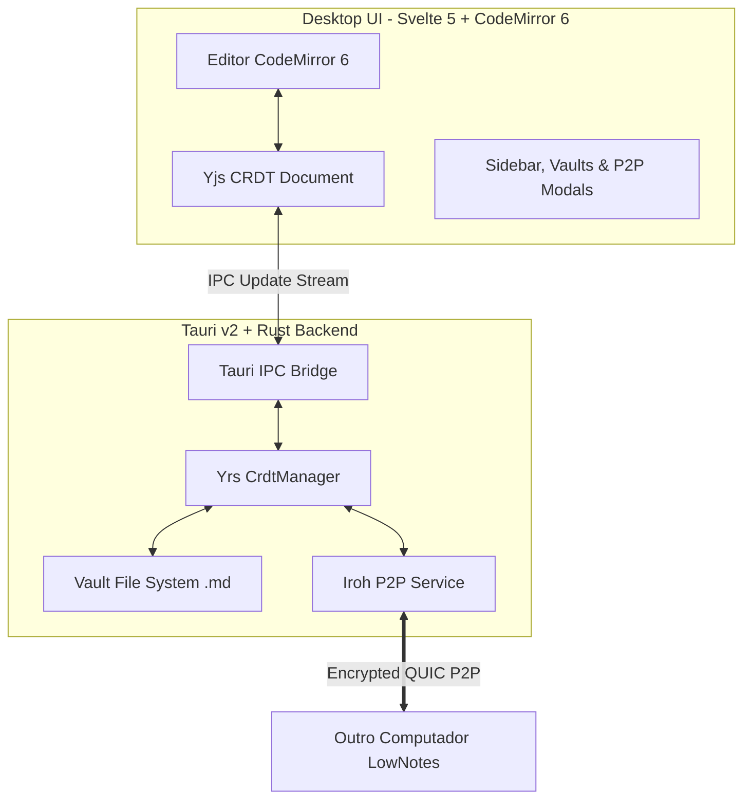

# LowNotes

Editor de notas Markdown desktop **local-first**, ultra-rápido, com **sincronização P2P criptografada** e **edição colaborativa em tempo real** sem necessidade de servidor central.

---

## ⚡ Filosofia LowBloat

- **Zero Bloat:** Binário leve nativo compilado com **Tauri v2** e **Rust**.
- **100% Compatível com Markdown:** Suas notas permanecem como arquivos `.md` limpos no seu disco rígido, acessíveis por qualquer editor (VS Code, Obsidian, Notepad).
- **Sem Servidor Central:** Sincronização direta de máquina para máquina via **Iroh** (QUIC ponta a ponta com criptografia ed25519 e transposição NAT/DERP).
- **Colaboração em Tempo Real (CRDT):** Mais de um usuário pode editar a mesma nota simultaneamente sem conflitos, unindo **CodeMirror 6 + Yjs** no frontend e **Yrs** no backend em Rust.
- **Assistente com skills:** Criação de documentos, planos e checklists, consulta ao vault e pesquisa web com fontes. Compatível com provedores OpenAI (Ollama, OpenAI, OpenRouter, Groq, LM Studio ou Custom), com busca local por palavras-chave e citações que abrem a nota na linha exata.
- **Exportação Word e PDF:** Exporte notas abertas ou rascunhos do assistente para `.docx` e `.pdf`, sem depender de um serviço de conversão.
- **Visualização de Diagramas Mermaid:** Renderização vetorial SVG interativa em tempo real de fluxogramas, gráficos de pizza e sequências no Markdown.
---

## 🏗️ Arquitetura



### Tecnologias

- **Desktop Shell & Backend:** Tauri v2 (Rust 2021)
- **Rede P2P:** [Iroh 1.2](https://iroh.computer/) (QUIC autenticado com chaves ed25519)
- **CRDT / Colaboração:** [Yrs](https://github.com/y-crdt/y-crdt) (Rust) & [Yjs](https://yjs.dev/) (TypeScript)
- **Frontend:** Svelte 5 (Runes), TypeScript, Tailwind CSS v4
- **Editor de Texto:** CodeMirror 6 (`@codemirror/lang-markdown`, `y-codemirror.next`)
- **Renderizador de Markdown & Diagramas:** markdown-it com extensões para listas de definição, notas de rodapé, abreviações, contêineres, emoji e listas de tarefas + [Mermaid 12](https://mermaid.js.org/)
- **Assistente IA & RAG:** RAG local no Rust compatível com APIs OpenAI (Ollama local, OpenAI, OpenRouter, Groq, LM Studio, etc.)

---

## 🚀 Como Executar

### Pré-requisitos

- [Rust](https://rustup.rs/) (1.77+)
- [Bun](https://bun.sh/) (1.1+)

### Desenvolvimento

Instale as dependências:
```bash
bun install
```

Inicie o aplicativo em modo de desenvolvimento:
```bash
bun run tauri dev
```

### Build de Produção

Gera o executável nativo otimizado:
```bash
bun run tauri build
```

O modo **Dividido** é o padrão. O tema e o modo de visualização escolhidos são salvos em `settings.json` no diretório de configuração do LowNotes, junto das demais preferências.

## Assistente e documentos

Abra o **Assistente** e selecione uma skill:

- **Assistente • criar e conversar:** responde perguntas e gera conteúdo novo, mesmo em um vault vazio.
- **Consultar notas:** responde com base nos trechos disponíveis e cita as notas de origem.
- **Criar documentos e planos:** gera uma ou várias notas completas. Exemplo: “Crie notas de acompanhamento para aprender Python, com etapas e checklists”.
- **Pesquisar na web:** faz uma busca ao vivo pelo texto da mensagem e fornece resultados com links. Em **Configurações → Busca web**, Firecrawl, Keenable, Exa MCP, DuckDuckGo e uma instância pública do SearXNG vêm ativados sem chave. O app alterna entre as fontes habilitadas e tenta a seguinte se uma falhar. Brave Search e Parallel podem ser ativados com uma chave própria; Firecrawl, Keenable e Exa aceitam chave opcional para limites maiores. Apenas os termos de busca são enviados ao serviço escolhido; as notas ficam fora dessa requisição. O modelo de IA selecionado continua necessário para elaborar a resposta. Instâncias públicas e serviços sem chave podem impor limites ou mudar a disponibilidade.

Os documentos gerados aparecem como rascunhos com caminho e conteúdo editáveis. Use **Salvar no vault** ou **Salvar todos**; uma nota existente nunca é sobrescrita. Após salvar, **Abrir nota salva** abre o documento no editor. Respostas comuns também oferecem **Transformar em nota**, Word e PDF, inclusive quando o modelo não gera rascunhos estruturados. É possível gerar até 10 notas por resposta, com até 256 KB por nota. Rascunhos e histórico são mantidos durante a sessão do vault; salve os documentos antes de trocar de vault ou fechar o aplicativo.

Os botões **Word** e **PDF** aparecem tanto nos rascunhos quanto na barra do editor. A exportação preserva títulos, parágrafos, ênfase, listas, tarefas, tabelas, código e links externos. Imagens são representadas por texto alternativo e endereço; diagramas Mermaid são exportados como código. A fonte Noto Sans acompanha o aplicativo para acentos e caracteres latinos, gregos e cirílicos; não há cobertura completa de emojis ou de todos os alfabetos. As bibliotecas de exportação são carregadas sob demanda.

As instruções das skills ficam em `src-tauri/skills/` e são incorporadas ao aplicativo no build. Não é necessário suporte a chamadas de ferramentas nativas no modelo: os documentos usam um formato estruturado validado no backend. A qualidade e a adesão ao formato dependem do modelo selecionado; respostas inválidas permanecem visíveis para permitir nova geração.

### Verificação

```bash
bun run check
bun test
cargo test --lib --manifest-path src-tauri/Cargo.toml
bun run build
```

---

## 🔗 Como Testar Pareamento P2P entre 2 Computadores

1. Abra o **LowNotes** nos dois computadores e selecione uma pasta para o seu Vault.
   - Use a versão atualizada nos dois computadores: o protocolo de sincronização CRDT é `lownotes/sync/2`.
2. No **PC 1**:
   - Clique em **P2P Offline** ou **Gerenciar Conexões** no rodapé da barra lateral.
   - Na aba **Compartilhar Código**, clique em **Copiar Código**.
3. No **PC 2**:
   - Abra a janela de **Sincronização P2P**.
   - Na aba **Conectar Dispositivo**, cole o código `LOWNOTES2_...` e clique em **Solicitar Pareamento**.
4. No **PC 1**:
   - Um alerta de confirmação aparecerá: *"O dispositivo Notebook (ID: ...) deseja sincronizar este vault. Deseja aceitar?"*.
   - Clique em **Aceitar Conexão**.
5. **Pronto!**
   - Os dois computadores agora estão pareados de forma confiável.
   - Qualquer nota criada ou editada em um PC sincroniza instantaneamente no outro.
   - Ao abrir a mesma nota nos dois computadores, a digitação reflete em tempo real sem servidor!

O histórico de mesclagem de cada nota fica em `.lownotes/crdt/` dentro do vault. Mantenha essa pasta junto com os arquivos Markdown ao fazer backup ou mover o vault.

---

## 🛡️ Licença

Distribuído sob a licença GPL-3.0. Consulte `LICENSE` para mais informações.
