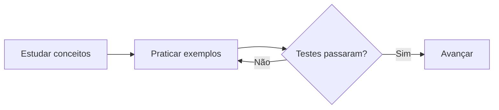
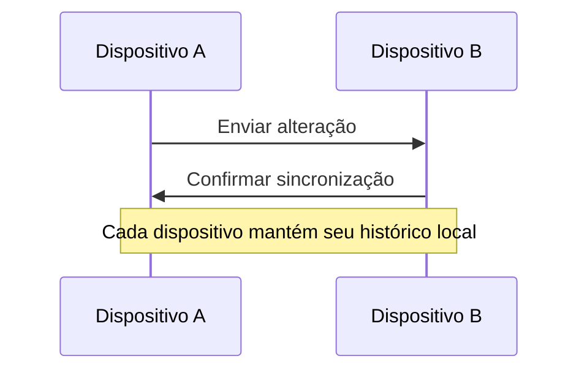

# Guia de estudos de Python

Este guia reúne **conceitos essenciais**, *atividades práticas* e resultados para acompanhar o aprendizado. Texto com acentuação: ação, funções, organização e São Paulo.

## Formatação e acompanhamento

Use `print("Olá, mundo!")` para testar. O conteúdo ~~antigo~~ foi ++atualizado++ e o próximo passo está ==destacado==. Fórmulas: H~2~O e x^2^. :smile: 🚀

- [ ] Estudar variáveis e tipos de dados
- [x] Instalar Python e preparar o editor
- Praticar com exemplos
  - Revisar funções
  - Escrever pequenos testes

3. Ler a documentação
4. Fazer o projeto final

> Reserve tempo para experimentar. Aprender envolve escrever código e revisar os resultados.

::: warning
Confira os exemplos antes de executar comandos em arquivos importantes.
:::

Variável
: Nome que identifica um valor usado pelo programa.

Função
: Bloco reutilizável de instruções com parâmetros e um resultado.

## Planejamento

| Semana | Atividade | Entregas |
| :--- | :---: | ---: |
| **1** | Variáveis e *operações* | 3 |
| **2** | Funções e `coleções` | 5 |
| **3** | Projeto ==prático== | 1 |

Veja [a documentação oficial](https://docs.python.org/3/) e [[Python/Referências|as referências da nota]]. Uma observação complementa este plano.[^fonte]

## Fluxo de aprendizagem



## Comunicação entre dispositivos



## Resultado visual

![Barras de progresso](data:image/png;base64,iVBORw0KGgoAAAANSUhEUgAAAlgAAACWCAYAAAACG/YxAAAACXBIWXMAAAsTAAALEwEAmpwYAAAJtUlEQVR4nO3ZsQ1VQQwEQGqhDXqhGHqjIAcgbQQtEHzhlW8CN7A3z7e692V+5Y+RAQMMMMAAAwwwkI9l8EWYPigGGGCAAQYYYCAfzUDB8lH5qBhggAEGGGDgl4IFgUXAAAMMMMAAA3+aM/CCVXAIRgYMMMAAAwzkVAYKVsEhGBkwwAADDDCQUxkoWAWHYGTAAAMMMMBATmWgYBUcgpEBAwwwwAADOZWBglVwCEYGDDDAAAMM5FQGClbBIRgZMMAAAwwwkFMZKFgFh2BkwAADDDDAQE5loGAVHIKRAQMMMMAAAzmVgYJVcAhGBgwwwAADDORUBgpWwSEYGTDAAAMMMJBTGShYBYdgZMAAAwwwwEBOZaBgFRyCkQEDDDDAAAM5lYGCVXAIRgYMMMAAAwzkVAYKVsEhGBkwwAADDDCQUxkoWAWHYGTAAAMMMMBATmWgYBUcgpEBAwwwwAADOZWBglVwCEYGDDDAAAMM5FQGClbBIRgZMMAAAwwwkFMZKFgFh2BkwAADDDDAQE5loGAVHIKRAQMMMMAAAzmVgYJVcAhGBgwwwAADDORUBgpWwSEYGTDAAAMMMJBTGShYBYdgZMAAAwwwwEBOZaBgFRyCkQEDDDDAAAM5lYGCVXAIRgYMMMAAAwzkVAYKVsEhGBkwwAADDDCQUxl8vGB9+/HbyOCfDWx/AEYGDDDAAAOjYClv18qbxWaxMcAAAwzMwQy8YBWUjJdn+wMwMmCAAQYYGAVrvxAYBcsytowZYIABBsYLllLUXAotKUuKAQYYYGAOZuAXYUHJeHm2PwAjAwYYYICBUbD2C4FRsCxjy5gBBhhgYLxgKUXNpdCSsqQYYIABBuZgBn4RFpSMl2f7AzAyYIABBhgYBWu/EBgFyzK2jBlggAEGxguWUtRcCi0pS4oBBhhg4KIBvwgLSsbLs/0BGBkwwAADDIyCtV8IjIJlGVvGDDDAAAPjBUspai6FlpQlxQADDDAwBzPwi7CgZLw82x+AkQEDDDDAwChY+4XAKFiWsWXMAAMMMDBesJSi5lJoSVlSDDDAAANzMAO/CAtKxsuz/QEYGTDAAAMMjIK1XwiMgmUZW8YMMMAAA+MFSylqLoWWlCXFAAMMMDAHM/CLsKBkvDzbH4CRAQMMMMDAKFj7hcAoWJaxZcwAAwwwMF6wlKLmUmhJWVIMMMAAA3MwA78IC0rGy7P9ARgZMMAAAwyMgrVfCIyCZRlbxgwwwAAD4wVLKWouhZaUJcUAAwwwMAcz8IuwoGS8PNsfgJEBAwwwwMAoWPuFwChYlrFlzAADDDAwXrCUouZSaElZUgwwwAADczADvwgLSsbLs/0BGBkwwAADDIyCtV8IjIJlGVvGDDDAAAPjBUspai6FlpQlxQADDDAwBzPwi7CgZLw82x+AkQEDDDDAwChY+4XAKFiWsWXMAAMMMDBesJSi5lJoSVlSDDDAAANzMAO/CAtKxsuz/QEYGTDAAAMMjIK1XwiMgmUZW8YMMMAAA+MFSylqLoWWlCXFAAMMMDAHM/CLsKBkvDzbH4CRAQMMMMDAKFj7hcAoWJaxZcwAAwwwMP/7BcvIgAEGGGCAAQbm8QwUrIJDMDJggAEGGGAgpzJQsAoOwciAAQYYYICBnMpAwSo4BCMDBhhggAEGcioDBavgEIwMGGCAAQYYyKkMFKyCQzAyYIABBhhgIKcyULAKDsHIgAEGGGCAgZzKQMEqOAQjAwYYYIABBnIqAwWr4BCMDBhggAEGGMipDBSsgkMwMmCAAQYYYCCnMvh4wfr687uRAQMMMFBoYPvCMTKYhzJQsAqWnpEBAwwoWPsXopHBKFiWsQuZAQYY8IKlECiFqc3AC5Yl7aJmgIFHDGxfOEYG81AGClbB0jMyYIABBWv/QjQyGAXLMnYhM8AAA16wFAKlMLUZeMGypF3UDDDwiIHtC8fIYB7KQMEqWHpGBgwwoGDtX4hGBqNgWcYuZAYYYMALlkKgFKY2Ay9YlrSLmgEGHjGwfeEYGcxDGShYBUvPyIABBhSs/QvRyGAULMvYhcwAAwx4wVIIlMLUZuAFy5J2UTPAwCMGti8cI4N5KAMFq2DpGRkwwICCtX8hGhmMgmUZu5AZYIABL1gKgVKY2gy8YFnSLmoGGHjEwPaFY2QwD2WgYBUsPSMDBhhQsPYvRCODUbAsYxcyAwww4AVLIVAKU5uBFyxL2kXNAAOPGNi+cIwM5qEMFKyCpWdkwAADCtb+hWhkMAqWZexCZoABBrxgKQRKYWoz8IJlSbuoGWDgEQPbF46RwTyUgYJVsPSMDBhgQMHavxCNDEbBsoxdyAwwwIAXLIVAKUxtBl6wLGkXNQMMPGJg+8IxMpiHMlCwCpaekQEDDChY+xeikcEoWJaxC5kBBhjwgqUQKIWpzcALliXtomaAgUcMbF84RgbzUAYKVsHSMzJggAEFa/9CNDIYBcsydiEzwAADXrAUAqUwtRl4wbKkXdQMMPCIge0Lx8hgHspAwSpYekYGDDCgYO1fiEYGo2BZxi5kBhhgwAuWQqAUpjYDL1iWtIuaAQYeMbB94RgZzEMZKFgFS8/IgAEGFKz9C9HIYBQsy9iFzAADDHjBUgiUwtRm4AXLknZRM8DAIwa2Lxwjg3koAwWrYOkZGTDAgIK1fyEaGYyCZRm7kBlggAEvWAqBUpjaDLxgWdIuagYYeMTA9oVjZDAPZfDxgmVkwAADDDDAAAPzeAYKVsEhGBkwwAADDDCQUxkoWAWHYGTAAAMMMMBATmWgYBUcgpEBAwwwwAADOZWBglVwCEYGDDDAAAMM5FQGClbBIRgZMMAAAwwwkFMZKFgFh2BkwAADDDDAQE5loGAVHIKRAQMMMMAAAzmVgYJVcAhGBgwwwAADDORUBgpWwSEYGTDAAAMMMJBTGShYBYdgZMAAAwwwwEBOZaBgFRyCkQEDDDDAAAM5lYGCVXAIRgYMMMAAAwzkVAYKVsEhGBkwwAADDDCQUxkoWAWHYGTAAAMMMMBATmWgYBUcgpEBAwwwwAADOZWBglVwCEYGDDDAAAMM5FQGClbBIRgZMMAAAwwwkFMZKFgFh2BkwAADDDDAQE5loGAVHIKRAQMMMMAAAzmVgYJVcAhGBgwwwAADDORUBgpWwSEYGTDAAAMMMJBTGShYBYdgZMAAAwwwwEBOZaBgFRyCkQEDDDDAAAM5lYGCVXAIRgYMMMAAAwzkVAYKVsEhGBkwwAADDDCQUxkoWAWHYGTAAAMMMMBATmWgYBUcgpEBAwwwwAADOZWBglVwCEYGDDDAAAMM5FQGClbBIRgZMMAAAwwwkFMZ/AVW7B7FfsEqggAAAABJRU5ErkJggg==)

## Código verdadeiro

```python
def saudacao(nome):
    mensagem = f"Olá, {nome}!"
    return mensagem

print(saudacao("São Paulo"))
```

[^fonte]: A documentação explica os tipos e as funções disponíveis no Python.
